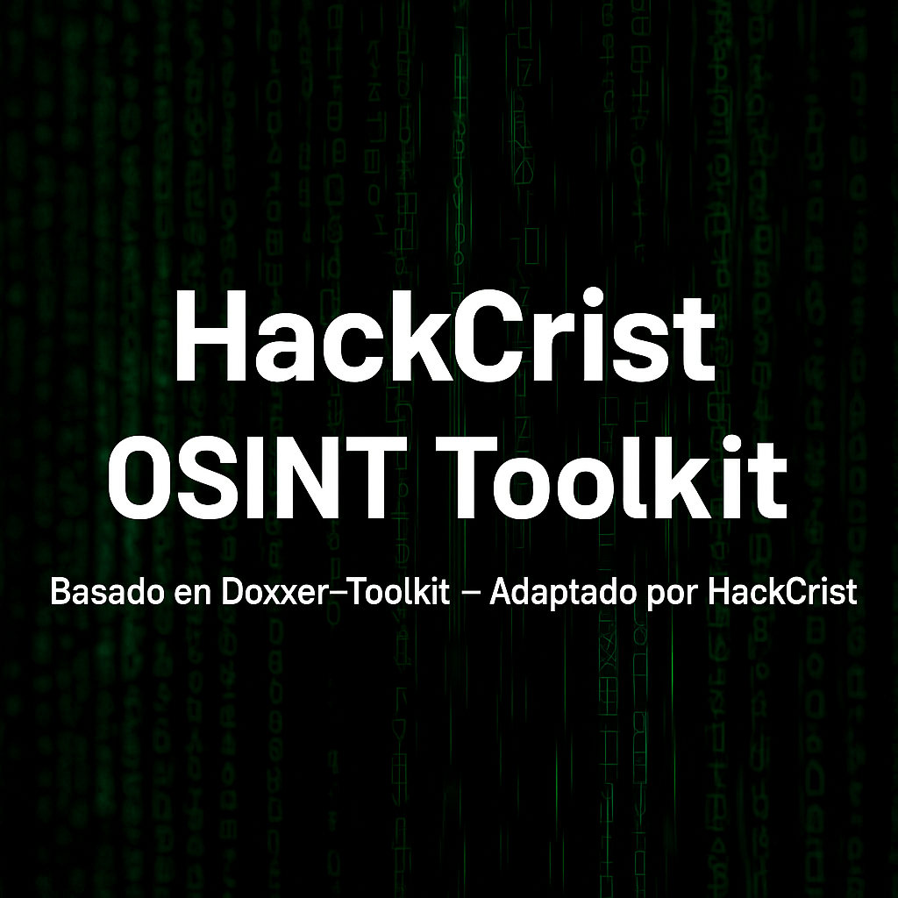

# 🚀 HackCrist OSINT Toolkit



```
██████╗  █████╗  ██████╗██╗  ██╗ ██████╗ ██████╗ ██╗███████╗████████╗
██╔══██╗██╔══██╗██╔════╝██║ ██╔╝██╔═══██╗██╔══██╗██║██╔════╝╚══██╔══╝
██║  ██║███████║██║     █████╔╝ ██║   ██║██████╔╝██║███████╗   ██║   
██║  ██║██╔══██║██║     ██╔═██╗ ██║   ██║██╔═══╝ ██║╚════██║   ██║   
██████╔╝██║  ██║╚██████╗██║  ██╗╚██████╔╝██║     ██║███████║   ██║   
╚═════╝ ╚═╝  ╚═╝ ╚═════╝╚═╝  ╚═╝ ╚═════╝ ╚═╝     ╚═╝╚══════╝   ╚═╝   
```

**Autor:** HackCrist  
**Basado en:** Doxxer-Toolkit de Euronymou5  
**Adaptado y mantenido por:** HackCrist  
**Licencias:** MPL-2.0 y Apache 2.0

---

## 📌 Descripción

**HackCrist OSINT Toolkit** es un menú interactivo de herramientas **OSINT** para **Termux y Kali Linux**, ideal para investigación y aprendizaje de técnicas de **recolección de información pública**.

Incluye Sherlock, Nexfil, GeoIP, PhoneInfoga, QR, shorteners y más.

**⚡ Uso solo educativo y ético.**

---

## ✅ Requisitos

- Python 3
- Termux o Kali Linux

---

## ⚡ Instalación rápida

```bash
pkg update -y && pkg upgrade -y
pkg install git python -y

git clone https://github.com/hackcrist/HackCrist_OSINT.git
cd HackCrist_OSINT
chmod +x install.sh
./install.sh
```

---

## ▶️ Ejecución

```bash
python3 toolkit.py
```

---

## ⚠️ Licencia

Publicado bajo:  
- **MPL-2.0**
- **Apache License 2.0**

**HackCrist** no se hace responsable del mal uso.

---

## 🙌 Créditos

Basado en **Doxxer-Toolkit** de Euronymou5  
**Autor y mantenimiento:** HackCrist

⭐ Si te ayuda, dale una estrella ⭐

💻 **Happy Hacking!**
